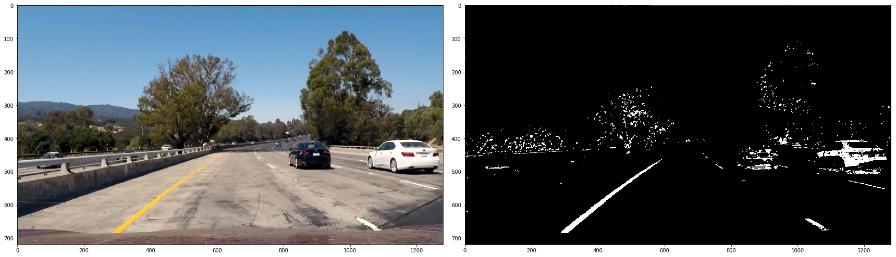

Advanced_Lane_Finding

### Goals / Steps:

* Compute the camera calibration matrix and distortion coefficients given a set of chessboard images.
* Apply distortion correction to other images.
* Use color transforms, gradients, etc. to create a thresholded binary image.
* Apply a perspective transform (a 'birds-eye' view) to rectify binary image.
* Detect lane pixels and fit to find the lane boundary.
* Determine the curvature of the lane and vehicle position with respect to center of lane.
* Warp the detected lane boundaries back onto the original image.
* Output visual display of the lane boundaries and numerical estimates of lane curvature and vehicle position.

### Camera calibration

The lens inside a camera have certain amount of curvatures, which means the lens are not flat. This will lead to distortion of images. Since autonomous driving requires high accuracy of measurements, camera calibration will be an important first step.

A chessboard is used to do the task, because its regular and high contrast pattern makes it easy to detect. A general idea is to attach a picture of a chessboard on a flat surface, and take several pictures with the camera that is needed to be calibrated. Then we compared the size and shape of the distorted image and the size and shape that they actually are. The differences will be the ecoefficiencies for calibration

Following are examples of finding objective points and the result of calibration.

### Image Processing

Gradient thresholds in both vertical and horizontal (Soble operation):

Then computes the magnitude of the gradient, and applies a threshold:

The direction of the gradient:

Make use of HLS color space since lightness (L) and saturation (S) channels are fairly consistent in shadow or excessive brightness conditions.

Combine all the image processing methods and we get:

### Perspective transform

Transform the lane lines image to another perspective - 'birds-eye' view. After applying perspective transform, it is easier to calculate the lane curvature degrees.

Two ways to fine the lanes: Peaks in a Histogram and Sliding Window. Then fit a second order polynomial to find the lanes.

### Calculation of radius of curvature and position of the vehicle

See functions `curvature()` and `position()`.

### Example result image

The resulting video can be viewed as `project_video_out.mp4`.